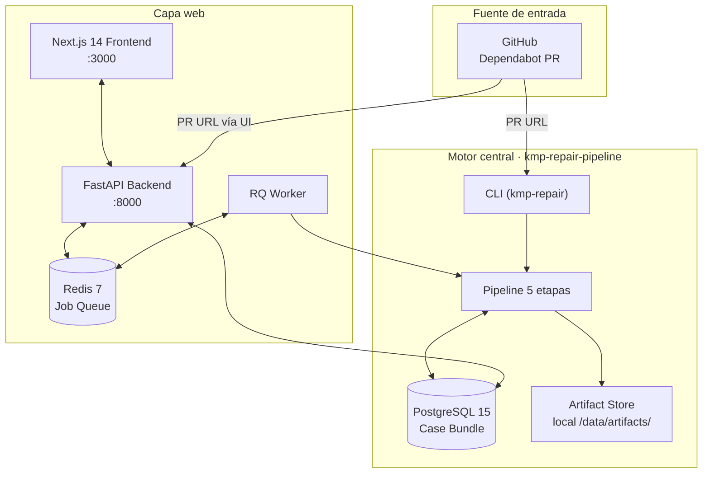
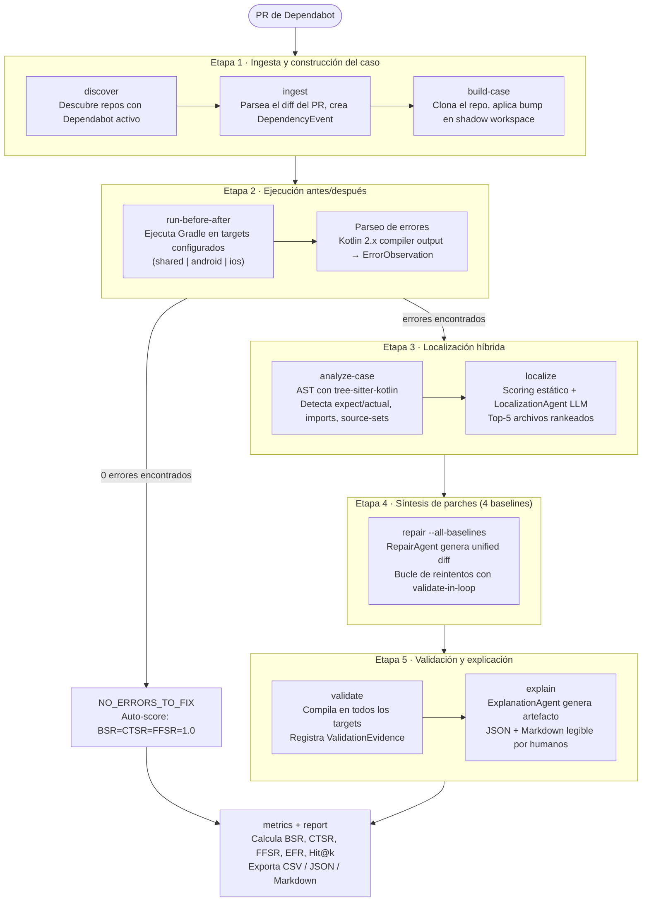
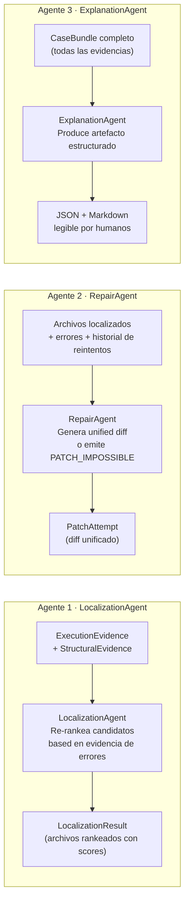
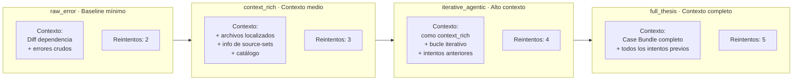
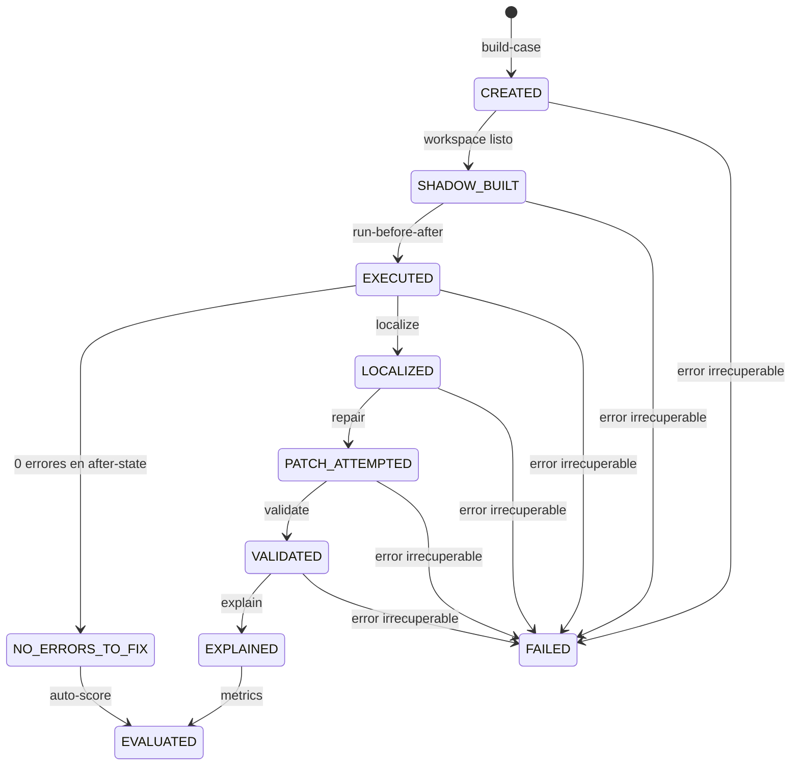
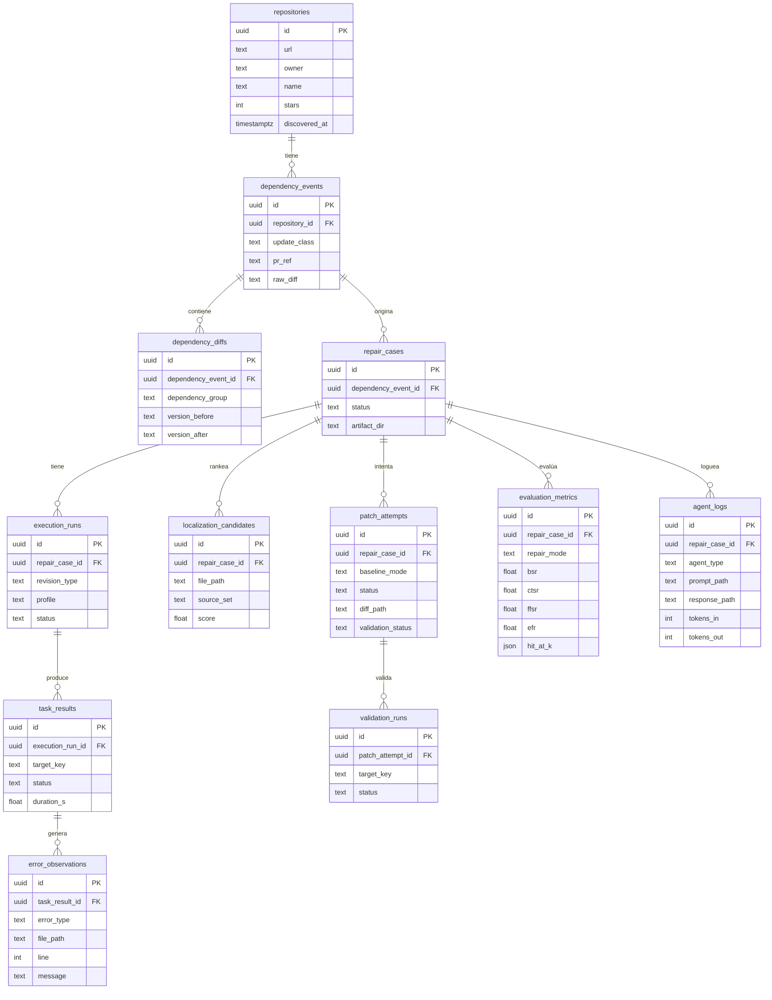
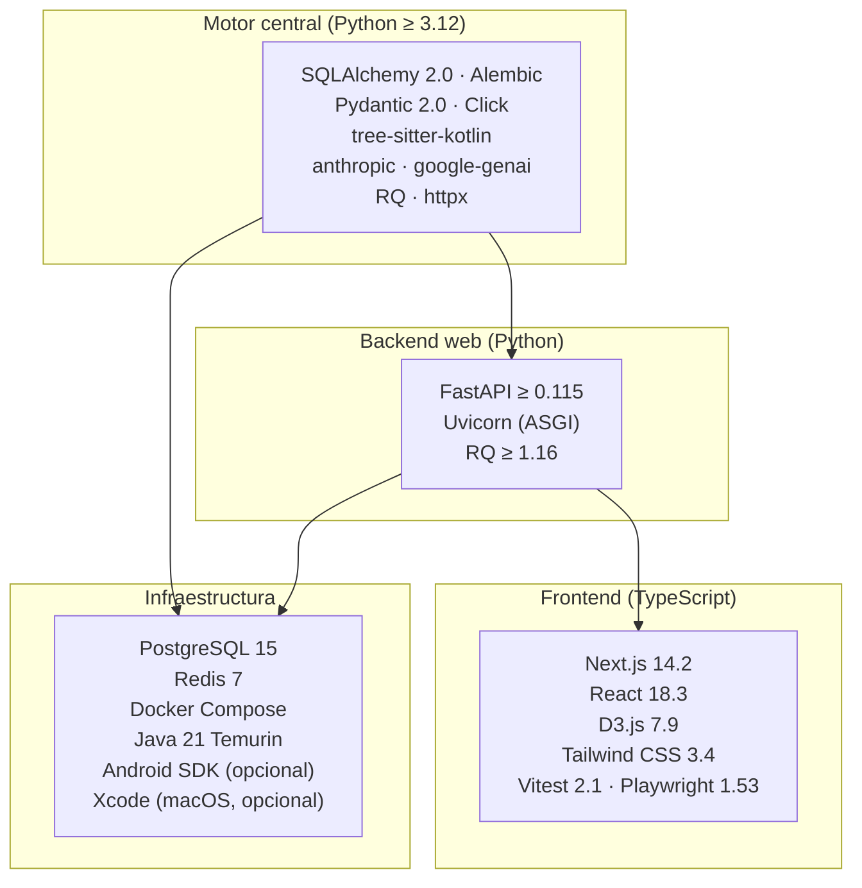
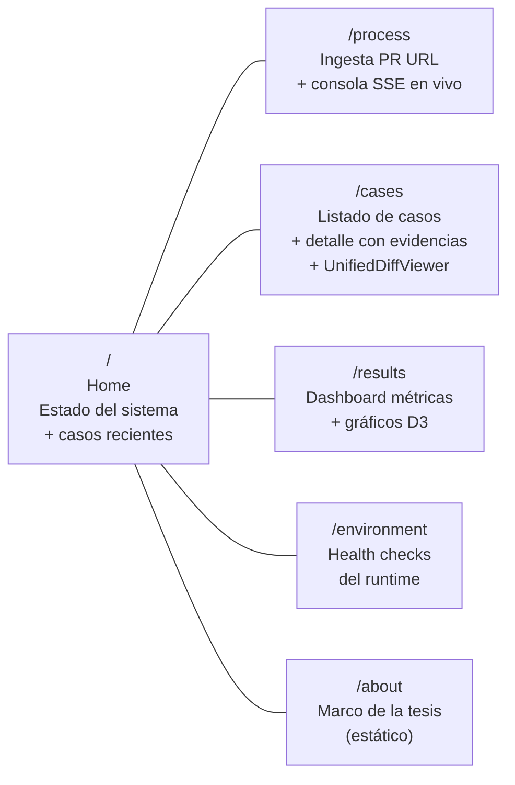

# KMP Dependency Repair — Multi-Agent Pipeline

**Trabajo de Fin de Máster · Santiago Bobadilla Suarez**

> Sistema automatizado de reparación de _breaking changes_ causados por actualizaciones de dependencias en proyectos **Kotlin Multiplatform (KMP)**, basado en una arquitectura de agentes LLM con evidencias estructuradas y benchmarking multi-baseline.

---

## Tabla de contenidos

1. [Visión general](#visión-general)
2. [Estructura del repositorio](#estructura-del-repositorio)
3. [Arquitectura del sistema](#arquitectura-del-sistema)
4. [Pipeline de reparación (5 etapas)](#pipeline-de-reparación-5-etapas)
5. [Agentes LLM](#agentes-llm)
6. [Baselines de reparación](#baselines-de-reparación)
7. [Ciclo de vida de un caso](#ciclo-de-vida-de-un-caso)
8. [Esquema de base de datos](#esquema-de-base-de-datos)
9. [Métricas de evaluación](#métricas-de-evaluación)
10. [Stack tecnológico](#stack-tecnológico)
11. [Puesta en marcha](#puesta-en-marcha)
12. [CLI de referencia](#cli-de-referencia)
13. [API REST y SSE](#api-rest-y-sse)
14. [Interfaz web](#interfaz-web)
15. [Tests](#tests)
16. [Limitaciones conocidas](#limitaciones-conocidas)

---

## Visión general

Cuando Dependabot actualiza una dependencia en un proyecto KMP, el compilador de Kotlin puede generar errores en múltiples _source sets_ (`commonMain`, `androidMain`, `iosMain`, …). Este sistema:

1. **Ingiere** el PR de Dependabot desde GitHub.
2. **Construye** un workspace aislado con la versión antes/después de la dependencia.
3. **Ejecuta** Gradle en los targets configurados y recoge los errores del compilador.
4. **Localiza** los archivos que causaron los errores (análisis estático + agente LLM).
5. **Repara** el código generando un parche unificado con un agente LLM, usando cuatro estrategias distintas.
6. **Valida** el parche compilando de nuevo en todos los targets.
7. **Explica** el resultado con un artefacto estructurado legible por humanos.
8. **Evalúa** con seis métricas reproducibles y exporta informes CSV/JSON/Markdown.

Todo el estado se persiste en PostgreSQL. Los agentes reciben objetos de contexto tipados, no historial conversacional.

---

## Estructura del repositorio

```
Tesis-Master/
├── Desarrollo/                        ← Código fuente
│   ├── kmp-repair-pipeline/           ← Motor central (Python, ~77 archivos, ~14 KLOC)
│   │   ├── src/kmp_repair_pipeline/
│   │   │   ├── cli/                   ← Punto de entrada CLI (Click)
│   │   │   ├── domain/                ← Tipos de dominio puros (sin I/O)
│   │   │   ├── case_bundle/           ← Modelo Case Bundle + serialización
│   │   │   ├── storage/               ← SQLAlchemy 2.0 + Alembic
│   │   │   ├── ingest/                ← Etapa 1: ingesta del PR de Dependabot
│   │   │   ├── case_builder/          ← Etapa 1/2: construcción del workspace
│   │   │   ├── runners/               ← Etapa 2: ejecución Gradle + parseo de errores
│   │   │   ├── static_analysis/       ← Etapa 3: análisis AST con tree-sitter-kotlin
│   │   │   ├── localization/          ← Etapa 3: LocalizationAgent + scoring híbrido
│   │   │   ├── repair/                ← Etapa 4: RepairAgent + síntesis de parches
│   │   │   ├── baselines/             ← Etapa 4: cuatro modos de reparación
│   │   │   ├── validation/            ← Etapa 5: validación multi-target
│   │   │   ├── explanation/           ← Etapa 5: ExplanationAgent
│   │   │   ├── evaluation/            ← Métricas (BSR, CTSR, FFSR, EFR, Hit@k)
│   │   │   ├── reporting/             ← Exportación CSV/JSON/Markdown
│   │   │   └── utils/                 ← LLM provider, logging, JSON I/O
│   │   ├── migrations/                ← Migraciones Alembic (versionado del esquema)
│   │   ├── tests/
│   │   │   ├── unit/                  ← 353 tests unitarios (sin Docker)
│   │   │   └── integration/           ← Tests de integración (requieren Docker)
│   │   ├── scripts/
│   │   │   ├── bootstrap_env.sh       ← Auto-detección Java, Android SDK, GCP
│   │   │   └── run_e2e.sh             ← Runner end-to-end completo
│   │   ├── docker-compose.yml         ← PostgreSQL 15
│   │   └── pyproject.toml
│   │
│   ├── fullstack/
│   │   ├── backend/                   ← Adaptador web (FastAPI + RQ, ~11 archivos)
│   │   │   ├── src/kmp_repair_webapi/
│   │   │   │   ├── app.py             ← 13 rutas REST + 2 streams SSE
│   │   │   │   ├── worker.py          ← Entrypoint del worker RQ
│   │   │   │   ├── job_runner.py      ← Encolado + ejecución de jobs
│   │   │   │   ├── orchestrator.py    ← Despacho de etapas → pipeline
│   │   │   │   ├── queries.py         ← Helpers de lectura de DB
│   │   │   │   ├── stages.py          ← Vocabulario de etapas + validación
│   │   │   │   ├── schemas.py         ← Esquemas Pydantic
│   │   │   │   └── settings.py        ← Configuración por env vars
│   │   │   ├── docker-compose.yml     ← PostgreSQL 15 + Redis 7
│   │   │   └── pyproject.toml
│   │   │
│   │   └── frontend/                  ← Interfaz web (Next.js 14, TypeScript)
│   │       ├── app/
│   │       │   ├── page.tsx           ← Home: estado + casos recientes
│   │       │   ├── process/           ← Ingesta + ejecución + consola en vivo
│   │       │   ├── cases/             ← Listado + detalle de casos
│   │       │   ├── results/           ← Dashboard de métricas + gráficos D3
│   │       │   ├── environment/       ← Health checks del runtime
│   │       │   └── about/             ← Marco de la tesis
│   │       ├── components/
│   │       │   ├── case/UnifiedDiffViewer
│   │       │   ├── reports/           ← Paneles de visualización D3
│   │       │   ├── LiveJobConsole     ← Visor de logs SSE
│   │       │   └── ActiveRunsStrip    ← Indicador de jobs activos (SSE)
│   │       └── lib/
│   │           ├── api.ts             ← Todas las llamadas al backend
│   │           ├── types.ts           ← Tipos TypeScript (respuestas API)
│   │           └── constants.ts       ← Vocabulario de etapas, modos y targets
│   │
│   └── CLAUDE.md                      ← Reglas del asistente IA
│
└── Documento/
    ├── Tesis_1.pdf                    ← Documento de tesis
    └── Papers/                        ← Literatura relacionada
```

---

## Arquitectura del sistema



---

## Pipeline de reparación (5 etapas)



---

## Agentes LLM

El sistema usa exactamente **tres agentes LLM** con temperatura = 0.0 (reproducibilidad estricta).



**Restricciones comunes a los tres agentes:**
- Temperatura = 0.0 (reproducibilidad)
- Todas las llamadas se loguean en DB (prompt, respuesta, tokens, latencia)
- Sin acceso directo al sistema de archivos ni a la base de datos
- Sin efectos secundarios fuera del Case Bundle asignado

---

## Baselines de reparación

El sistema compara cuatro estrategias para medir cuánto contexto aporta cada nivel:



Todos los baselines comparten el **validate-in-loop**: tras aplicar cada parche se ejecuta la validación inmediatamente. Si `VALIDATED`, el bucle termina. Si `REJECTED` con progreso (menos errores), los errores restantes alimentan el siguiente intento.

---

## Ciclo de vida de un caso



---

## Esquema de base de datos



---

## Métricas de evaluación

| Métrica | Definición | Condición de éxito |
|---------|-----------|-------------------|
| **BSR** (Build Success Rate) | Éxito de validación general | `ValidationStatus == SUCCESS_REPOSITORY_LEVEL` |
| **CTSR** (Cross-Target Success Rate) | Ningún target ejecutable falla | Sin `FAILED_BUILD` en targets ejecutables |
| **FFSR** (File Fix Success Rate) | Los archivos rotos quedan reparados | Todos los targets `== SUCCESS_REPOSITORY_LEVEL` |
| **EFR** (Error Fix Rate) | Eliminación de errores con penalización | `max(0, efr_raw - penalización)` |
| **EFR_normalized** | EFR sin contar desplazamiento de línea | Estimación conservadora |
| **Hit@k** | Precisión de localización en rank k | Archivo ground-truth en top-k (k=1,3,5) |

> Los targets `NOT_RUN_ENVIRONMENT_UNAVAILABLE` se excluyen de los denominadores.

```mermaid
quadrantChart
    title Cobertura de métricas por dimensión
    x-axis Localización --> Reparación
    y-axis Binario --> Continuo
    BSR: [0.75, 0.15]
    CTSR: [0.80, 0.25]
    FFSR: [0.85, 0.35]
    EFR: [0.70, 0.75]
    EFR_normalized: [0.65, 0.85]
    Hit@1: [0.20, 0.55]
    Hit@3: [0.25, 0.65]
    Hit@5: [0.30, 0.75]
```

---

## Stack tecnológico



---

## Puesta en marcha

### Prerrequisitos

| Herramienta | Versión mínima | Notas |
|-------------|---------------|-------|
| Python | 3.12 | Usar pyenv o mise con `.python-version` |
| Node.js | 18 | Para el frontend |
| Java | 21 Temurin | Kotlin no soporta Java 25 |
| Docker | 24 | PostgreSQL + Redis |
| Android SDK | opcional | Para targets Android |
| Xcode | opcional | Para targets iOS (solo macOS) |

Clave LLM: definir `ANTHROPIC_API_KEY` o `GOOGLE_APPLICATION_CREDENTIALS`.

---

### 1 · Motor central (CLI)

```bash
cd Desarrollo/kmp-repair-pipeline

# Iniciar base de datos
docker compose up -d

# Entorno Python
python3.12 -m venv .venv
source .venv/bin/activate
pip install -e ".[dev]"

# Aplicar migraciones
alembic upgrade head

# Bootstrap (auto-detecta Java, Android SDK, GCP)
source scripts/bootstrap_env.sh

# Verificar instalación
kmp-repair doctor
```

### 2 · Backend web

```bash
cd Desarrollo/fullstack/backend

# Infraestructura (Postgres + Redis)
docker compose up -d

# Instalar
pip install -e ../../kmp-repair-pipeline
pip install -e .

# Configurar
cp .env.example .env
# Editar .env: KMP_DATABASE_URL, proveedor LLM, etc.
```

### 3 · Frontend

```bash
cd Desarrollo/fullstack/frontend

npm install

# URL del backend
echo 'NEXT_PUBLIC_API_BASE_URL=http://localhost:8000' > .env.local
```

### 4 · Ejecutar el stack completo (5 terminales)

```bash
# Terminal 1: Base de datos
cd Desarrollo/fullstack/backend && docker compose up

# Terminal 2: Migraciones (una sola vez)
cd Desarrollo/kmp-repair-pipeline && alembic upgrade head

# Terminal 3: API backend (puerto 8000)
cd Desarrollo/fullstack/backend
source .venv/bin/activate
kmp-repair-api

# Terminal 4: Worker RQ
kmp-repair-worker

# Terminal 5: Frontend (puerto 3000)
cd Desarrollo/fullstack/frontend
npm run dev
```

Abrir **http://localhost:3000**

---

## CLI de referencia

```bash
# Diagnóstico
kmp-repair doctor

# Ingesta de un PR de Dependabot
kmp-repair ingest --pr-url https://github.com/owner/repo/pull/42

# Etapas del pipeline (en orden)
kmp-repair build-case      <case_id>
kmp-repair run-before-after <case_id>
kmp-repair analyze-case    <case_id>
kmp-repair localize        <case_id>
kmp-repair repair          <case_id> --all-baselines
kmp-repair validate        <case_id>
kmp-repair explain         <case_id>
kmp-repair metrics         <case_id>

# Informes
kmp-repair report --format all    # CSV + JSON + Markdown
kmp-repair report --format csv
kmp-repair report --format json
kmp-repair report --format markdown
```

---

## API REST y SSE

| Método | Ruta | Descripción |
|--------|------|-------------|
| `POST` | `/api/cases` | Crea caso a partir de una PR URL |
| `GET` | `/api/cases` | Lista todos los casos |
| `GET` | `/api/cases/{case_id}` | Detalle + timeline de evidencias |
| `POST` | `/api/cases/{case_id}/jobs/pipeline` | Ejecuta el pipeline completo |
| `POST` | `/api/cases/{case_id}/jobs/{stage}` | Ejecuta una etapa concreta |
| `GET` | `/api/jobs/{job_id}` | Estado del job |
| `GET` | `/api/jobs/{job_id}/stream` | **SSE**: logs en tiempo real |
| `GET` | `/api/runs/active/stream` | **SSE**: jobs activos |
| `GET` | `/api/results/metrics` | Dashboard de métricas agregadas |
| `GET` | `/api/health` | Health check |

---

## Interfaz web



---

## Tests

| Suite | Tecnología | Tests | Requisito |
|-------|-----------|------:|-----------|
| Pipeline · unitarios | pytest | **353** | Sin Docker |
| Pipeline · integración | pytest | varios | Docker |
| Backend · endpoints | pytest + httpx | 50+ | Sin Docker |
| Frontend · unitarios | Vitest | varios | Sin Docker |
| Frontend · e2e | Playwright | 14 | Stack completo |

```bash
# Tests unitarios del pipeline (sin Docker)
cd Desarrollo/kmp-repair-pipeline
pytest tests/unit/ -v

# Tests del backend
cd Desarrollo/fullstack/backend
pytest tests/ -v

# Tests unitarios del frontend
cd Desarrollo/fullstack/frontend
npm test

# Tests e2e (requiere stack en marcha)
npm run test:e2e
```

---

## Limitaciones conocidas

| # | Área | Descripción |
|---|------|-------------|
| 1 | Parseo de errores | Solo formato Kotlin 2.x. Cambios de formato en versiones futuras pueden degradar silenciosamente la extracción. |
| 2 | Límite de contexto | RepairAgent recibe máximo 8.000 bytes por archivo. Archivos más grandes se truncan. |
| 3 | Localización | Solo los top-5 archivos llegan al RepairAgent. Errores en posiciones 6+ no se reparan en un solo paso. |
| 4 | iOS | La validación requiere macOS con Xcode instalado. |
| 5 | Dependencias transitivas | Sin estrategia estructurada para conflictos en diamante. |
| 6 | Alias renames | Detectados y expuestos en el contexto de reparación, pero aparecen como `COMPILE_ERROR` genérico en el parseo. |

---

## Principios de diseño

- **Evidencia, no memoria conversacional.** Los agentes reciben objetos de contexto tipados derivados del Case Bundle, nunca historial creciente de chat.
- **Un agente, una responsabilidad.** Los tres agentes están fijos; no añadir un cuarto.
- **Reproducibilidad ante todo.** Temperatura 0.0, workspace aislado por baseline, sin estado compartido entre modos.
- **Audit trail completo.** Cada llamada a un agente se loguea en DB con prompt, respuesta, tokens y latencia.
- **El motor no sabe nada del web.** La capa web es un adaptador; no duplica lógica del pipeline.
- **Migraciones obligatorias.** Todo cambio de esquema pasa por Alembic; nunca DDL manual.

---

*Máster Universitario en Ingeniería del Software · 2025–2026*
